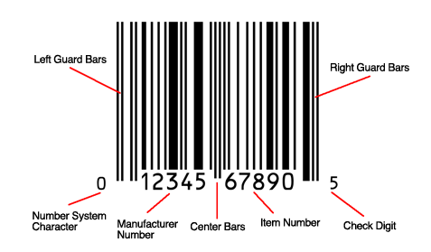

There are various types of barcodes and standards, here, I'll be referring to UPC-A barcodes.



- They can store a total of 12 decimal digits, out of which 10 are usable
- The first digit is the system digit, which is used to identify the type of product
- The next 5 digits are the manufacturer code
- The last 5 digits are the product code
- The last digit is the check digit, which is used to verify the validity of the barcode

## How do barcodes store data?

The pattern of each section determines the value of the digit.
These patterns are defined in the specifications of the barcode standard.
The specifications also split the barcode into two sections, the left and right sections.
The left section or the even section is used to store the first 6 digits, and the right section or the odd section is used to store the last 6 digits.
The last check digit is calculated using the Luhn algorithm.
There are different encodings for both the sides, which are provided below.

```js:title=barcode.js
//These are the bounding characters for the barcode, in the specifications
const sideGuard = "101";
const centerGuard = "01010";

//The barcode spec defines these specific values for both sides of the barcode
const leftEncoding = [
    "0001101", //0
    "0011001", //1
    "0010011", //2
    "0111101", //3
    "0100011", //4
    "0110001", //5
    "0101111", //6
    "0111011", //7
    "0110111", //8
    "0001011"  //9
];

const rightEncoding = [
    "1110010", //0
    "1100110", //1
    "1101100", //2
    "1000010", //3
    "1011100", //4
    "1001110", //5
    "1010000", //6
    "1000100", //7
    "1001000", //8
    "1110100"  //9
];

function generate(code) {
    //Handle too large codes
    if (code.length > 10) return null;

    //Make the code to length 10 if it is shorter
    if (code.length < 10) code = "0".repeat(10 - code.length) + code;

    //An int array that stores all the 12 digits of the barcode
    barcodeDigits = [
        5, //The number system digit/ type digit
        ...[...code].map(v=>+v)
    ]

    //Add the check digit to the array
    checksum = barcodeDigits.reduceRight(
        //Multiply by 3 if it is in an odd position, ie., even index
        (acc, curr, i) => acc + curr * (i % 2 === 0 ? 3 : 1)
    );

    //Check digit is next multiple of 10 - checksum
    //To get next multiple of 10, ((n + 9) / 10) * 10
    csd = Math.floor((checksum + 9) / 10) * 10 - checksum;
    barcodeDigits.push(csd);

    //Convert barcode digits to binary string representations
    c = barcodeDigits.map((value, index) => (index < 6? leftEncoding : rightEncoding)[value])

    //Convert binary string representations to final barcode line
    barcodeSegments = c.map(b => getCharRep(b));

    barcode = [];
    //Add dividing bits
    barcode[0] = getCharRep(sideGuard);
    barcode[7] = getCharRep(centerGuard);
    barcode[14] = getCharRep(sideGuard);
    for(i = 1; i <= 6; i++) {
        barcode[i] = barcodeSegments[i-1];
        barcode[14-i] = barcodeSegments[12-i];
    }

    return barcode.join('');
}

function getCharRep(str) {
    return [...str].map(c => +c ? "█" : " ").join('');
}

const input = "69420";
(generate(input)+"\n").repeat(10);
```

## HTML

```html
<!DOCTYPE html>
<html lang="en" data-theme="light">
  <head>
    <meta charset="utf-8" />
    <meta name="viewport" content="width=device-width, initial-scale=1.0" />
    ...
    <script>
      // If there's a theme stored in localStorage, use it on the <html>
      const localStorageTheme = localStorage.getItem('theme');
      if (localStorageTheme) {
        document.documentElement.setAttribute('data-theme', localStorageTheme);
      }
    </script>
  </head>
  <body>
    <div class="theme-toggle">
      <button
        class="theme-toggle-btn js-theme-toggle"
        aria-label="Activate dark mode"
        title="Activate dark mode"
      >
        <!--
        <svg class="light-mode">
          <use xlink:href="#sun"></use>
        </svg>
        <svg class="dark-mode">
          <use xlink:href="#moon"></use>
        </svg>
        -->
      </button>
    </div>

    <script src="app.js"></script>
  </body>
</html>
```

## CSS Variables

```css
:root {
  --bg: #ffffff;
  --text: #000000;
}

[data-theme='dark'] {
  --bg: #000000;
  --text: #ffffff;
}
```

## JavaScript

```js:title=app.js
const themeToggleBtn = document.querySelector('.js-theme-toggle');

themeToggleBtn.addEventListener('click', () => onToggleClick());

const onToggleClick = () => {
  const { theme } = document.documentElement.dataset;
  const themeTo = theme && theme === 'light' ? 'dark' : 'light';
  const label = `Activate ${theme} mode`;

  document.documentElement.setAttribute('data-theme', themeTo);
  localStorage.setItem('theme', themeTo);

  themeToggleBtn.setAttribute('aria-label', label);
  themeToggleBtn.setAttribute('title', label);
};
```

## Resources

- <https://www.gtin.info/barcode-101/>
- <https://en.wikipedia.org/wiki/Universal_Product_Code>
